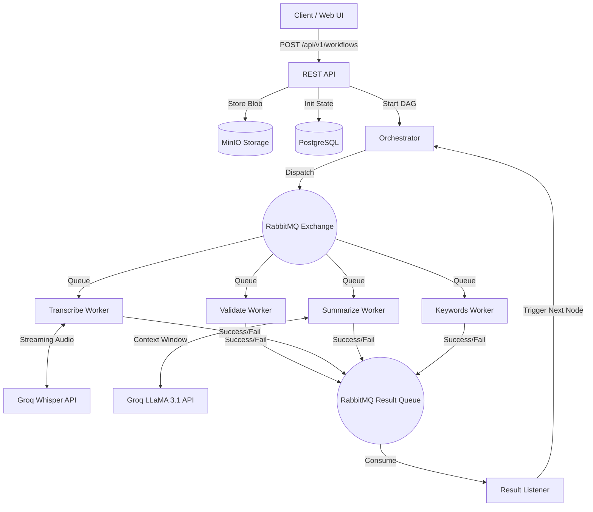

# Shruti

Shruti is a distributed audio orchestration engine built with Spring Boot 3. It serves as an exploration into building resilient, event-driven distributed systems in the Spring ecosystem. The architecture is designed around asynchronous message passing, fault tolerance, and modular micro-tasking.

This project marks the beginning of a journey into distributed systems architecture, focusing heavily on backend orchestration patterns rather than simple CRUD operations.

## Architecture & Technical Depth

The system is built on an event-driven orchestrator pattern. When an audio file is ingested, it is securely stored in an S3-compatible blob store (MinIO), and a state machine is initialized in PostgreSQL. The `OrchestratorService` then dispatches a series of discrete, idempotent tasks to RabbitMQ.



### Core Concepts Demonstrated

1. **State Machine Orchestration**: Instead of synchronous method calls, the pipeline (Validation -> Transcription -> Summarization -> Keyword Extraction) is managed by an Orchestrator. As workers complete tasks asynchronously, they emit events back to a result queue. The Orchestrator listens to these events, mutates the workflow state in the database, and dispatches the subsequent task.
2. **Fault Tolerance and Retry Semantics**: Distributed systems fail. The project implements a custom `RetryScheduler` that periodically sweeps the database for stalled or failed tasks and automatically re-queues them, up to a defined maximum attempt threshold, using exponential backoff principles.
3. **Idempotent Workers**: Workers are designed to safely process duplicate messages from RabbitMQ without causing side effects or corrupting data in MinIO or Postgres.
4. **Observability**: Built-in integration with Micrometer exposes custom metrics (task failure rates, retry counts, transcription latency distributions) over Actuator endpoints. These metrics power a live monitoring dashboard.
5. **Database Versioning**: Flyway is utilized to ensure deterministic schema migrations across deployments.

## Infrastructure Stack

- **Application Framework**: Java 21, Spring Boot 3, Spring Data JPA
- **Message Broker**: RabbitMQ (AMQP 0-9-1)
- **Relational Database**: PostgreSQL 16
- **Blob Storage**: MinIO (S3 API compatible)
- **Caching**: Redis
- **AI Inference**: Groq (Whisper-large-v3-turbo and Llama-3.1-8b-instant)

## Running the System

The entire infrastructure, including the application layer, is containerized. There is no requirement for a local Java runtime or Maven installation to start the system.

1. Clone the repository:
   ```bash
   git clone https://github.com/devarshganatra/audio-workflow-orchestration.git
   cd audio-workflow-orchestration
   ```

2. Configure environment variables:
   Create a `.env` file in the root directory and provide your inference API key.
   ```text
   GROQ_API_KEY=your_groq_api_key_here
   ```

3. Build and initialize the distributed stack:
   ```bash
   docker compose up --build -d
   ```

4. Interact with the system:
   The API and the accompanying frontend observability dashboard are bound to port 8080.
   Navigate to `http://localhost:8080` to submit jobs and trace the workflow execution through the distributed workers.
